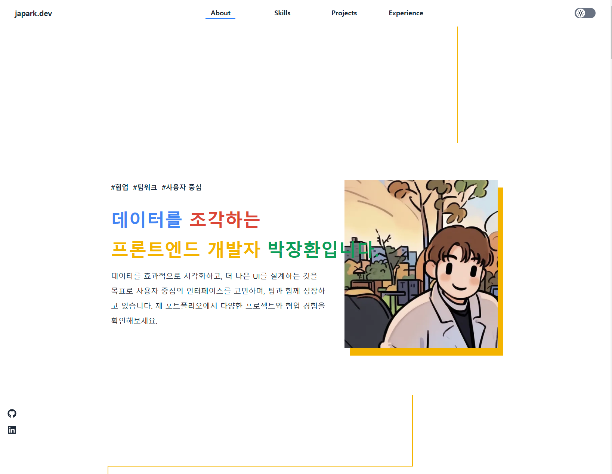

[](https://opensource.org/licenses/MIT)

## Portfolio Webseite

이 프로젝트는 React, Tailwind CSS, TypeScript를 사용하여 제작된 프론트엔드 포트폴리오 웹사이트입니다.  
신입 프론트엔드 개발자로서의 기술 스택과 프로젝트 경험을 소개하는 웹사이트입니다.

<br/>

## 데모 (Demo)



<br/>

## 주요 기능 (Features)

1. 반응형 디자인 : 모바일 & 데스크톱 최적화
2. 다크 모드 지원 : 다크모드 버튼 지원
3. GSAP 애니메이션 : 부드러운 인터랙션 효과 적용
4. 프로젝트 & 기술 스택 소개 : 개발 경험과 프로젝트 정리

<br/>

## 설치 방법 (Installation)

### 1. 저장소 클론 (Clone the Repo)

```bash
  git clone <reponame>
```

### 2. 의존성 패키지 설치 (Install Dependencies)

```bash
npm install
```

또는

```bash
npm i
```

### 3. 개발 서버 실행 (Start Server)

```bash
npm run dev
```

<br/>

## 기술 스택 (Tech Stack)

### 프론트엔드 (Client)

- React
- React Router
- Vitest

<br/>

## 지원 및 문의 (Support)

이 프로젝트가 유용하다고 생각되시면, ⭐ Star를 눌러주세요!  
추가적인 문의 사항이 있다면, Issues에 등록해 주시면 확인하겠습니다. 😊
